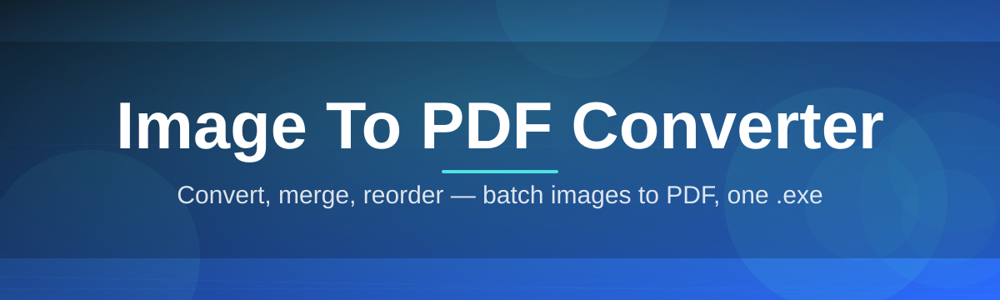
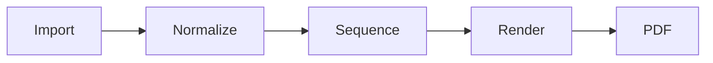

# image-to-pdf-tool 📄✨

  

*Drop your images in, pull a PDF out — zero fuss, zero bloat, zero excuses.*

  

---

## 🖼️ Overview

**image-to-pdf-tool** is a weekend project that outgrew its weekend. It converts JPG, PNG, BMP, WEBP, and TIFF images into clean, print-ready PDF documents — one file, a folder, or a whole batch at a time. No cloud upload, no account wall, no "sign in to continue." Your images stay on your machine because that's where they belong.

This exists because every "free online image to PDF converter" out there wants your email, your data, or thirty seconds of your patience watching ads spin. I wanted a tool that opens in under a second, does the one job it's built for, and gets out of the way. So I built one.

It's for students bundling scanned notes, small businesses digitizing receipts, photographers assembling portfolio PDFs, and anyone tired of pasting images into a Word doc just to "print to PDF." If you've ever muttered *"there has to be a simpler way"* — this is that simpler way.

---

## 📋 Requirements

| Requirement | Details |
|---|---|
| **OS** | Windows 10 / Windows 11 (64-bit) |
| **RAM** | 2 GB minimum, 4 GB recommended |
| **Disk space** | ~80 MB |
| **Dependencies** | None — fully standalone |
| **Internet** | Not required after download |
| **.NET / runtimes** | Not required |

> [!NOTE]
> No installer wizard, no background services, no telemetry pinging home. It's an executable that respects your time.

---

## 🔥 What It Actually Does

- **Batch conversion, not one-at-a-time babysitting** — load a folder of hundreds of images and walk away. It chews through them in order.

- **Drag-and-drop ingestion** — drop images straight onto the window. No "Browse..." dialog required unless you want one.

- **Page ordering, your rules** — reorder pages before export with simple drag reordering. The PDF mirrors exactly what you see.

- **Smart page sizing** — auto-fit to A4, Letter, or match the original image dimensions pixel-for-pixel. No stretched, blurry scans.

- **Compression control** — dial quality up for archival-grade PDFs or down for email-friendly file sizes. You decide the trade-off.

- **Multi-format input** — JPG, PNG, BMP, WEBP, TIFF, and GIF (first frame) all convert without a format-conversion detour.

- **Merge existing PDFs into the mix** — append scanned image pages onto an existing PDF instead of starting over.

- **Instant local preview** — see the assembled PDF layout before you commit to exporting anything.

> [!TIP]
> Rotating a scanned page? Right-click the thumbnail. Rotation is baked into the export — no separate "fix orientation" pass needed.

---

## 🚀 Getting Started

1. **Visit the landing page** using the download button above.

2. **Download the executable** — no bundled installer junk, no third-party offers.

3. **Run it** — Windows may flag it as unrecognized on first launch (see Troubleshooting below); allow it through.

4. **Drop your images, arrange them, hit Export** — your PDF lands in the folder you choose.

> [!IMPORTANT]
> Always download from the official landing page linked in this README. Mirrors and reuploads are not maintained by this project and cannot be trusted for updates or safety.

---

## 🛠️ How It Works

The pipeline is deliberately simple — fewer moving parts, fewer things to break:

1. **Import** — images are read and decoded locally, in memory.
2. **Normalize** — each image is oriented, color-corrected, and scaled to your chosen page size.
3. **Sequence** — pages are ordered per your drag-and-drop arrangement.
4. **Render** — each normalized image becomes one PDF page, embedded (not re-compressed unless you asked for it).
5. **Export** — pages are stitched into a single PDF and written to disk.

---

## 🧩 Troubleshooting

<strong>Windows says "unrecognized publisher" — is this safe?</strong>

Yes. This is a small independent project without a paid code-signing certificate. Click "More info" → "Run anyway" to proceed.

<strong>My exported PDF is huge. Why?</strong>

You likely have compression set to "archival quality." Lower the compression slider before exporting for web-friendly file sizes.

<strong>Images look rotated in the PDF but not in the preview.</strong>

This usually means EXIF orientation data conflicts with a manual rotate. Reset rotation on that thumbnail and reapply once.

<strong>Can it convert PDF back to images?</strong>

No — this tool is one-directional, image-to-pdf-tool by name and by design. Reverse conversion is a different problem for a different tool.

<strong>The app won't open at all.</strong>

Confirm you're on Windows 10/11 64-bit. Re-download from the official landing page — a partial download is the most common culprit.

> [!WARNING]
> Very large batches (500+ high-resolution images) will use significant RAM during rendering. Close other heavy applications first.

---

## 🎨 UI & UX Notes

- **Themes** — Light and Dark, auto-detected from your Windows setting, override-able in Settings.
- **Keyboard shortcuts**:

| Action | Shortcut |
|---|---|
| Open images | `Ctrl + O` |
| Export PDF | `Ctrl + E` |
| Remove selected | `Delete` |
| Rotate right | `Ctrl + R` |
| Select all | `Ctrl + A` |

- **Settings persistence** — your last-used page size, compression level, and theme are remembered between sessions.
- **Live thumbnail grid** — resizable, zoomable, drag-reorderable.

---

## 🤝 Contributing & Community

This started as one person's weekend itch — it grew because people cared enough to open issues and suggest fixes.

- 🐛 Found a bug? Open an issue with steps to reproduce.
- 💡 Have an idea? Discussions are open for feature requests.
- 🔧 Want to contribute code? Fork, branch, PR — clear commit messages appreciated.

  

> [!TIP]
> Small, focused PRs get reviewed faster than sprawling ones. One feature per PR.

---

## 📜 License

Released under the [MIT License](LICENSE), 2026. Use it, fork it, ship it in your own project — just keep the license notice intact.

---

## ⚠️ Disclaimer

This tool is provided "as is," without warranty of any kind. The maintainer isn't liable for data loss, corrupted files, or existential crises caused by disorganized image folders. Always keep backups of original images before batch processing.

> [!NOTE]
> This is an independent, community-driven project. It is not affiliated with any commercial PDF vendor.

---

## 🗒️ Changelog

### v2026.3 — "Steady Hands"
- Fixed rotation mismatch between preview and export
- Reduced memory footprint for large batches by ~30%
- Added Letter/A4 auto-detect based on image DPI

### v2026.2 — "Second Pass"
- Introduced PDF merge (append pages to existing PDF)
- Dark theme auto-detection from Windows settings
- Squashed a crash on corrupted WEBP files

### v2026.1 — "First Light"
- Initial public release
- Batch conversion, drag-drop, compression slider
- JPG, PNG, BMP, TIFF, GIF support

---

